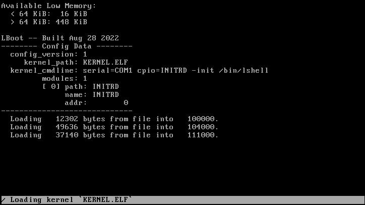

LBoot
=====

x86 bootloader for floppy disks. For a working example of LBoot being used, see
[Lambda OS](https://github.com/farlepet/lambda-os).



Current Support
---------------

 - Filesystems
   - FAT12
     - Limited to the boot device
     - No long filename support
 - Kernel Format
   - ELF
 - Multiboot 2 (optional)
   - `CMDLINE`
   - `BOOTLOADER_NAME`
   - `MODULE`
   - `BASIC_MEMINFO`
   - `MMAP`
   - `ACPI_OLD`
   - `ACPI_NEW`
 - Outputs
   - VGA
   - Serial

Features can be toggled via `inc/config.h`. Stage 2 size based on features:
 - All features disabled:      ~13 KiB
 - With all features:          ~14 KiB
 - With all debugging enabled: ~15 KiB

Future Work
-----------

 - Loading kernel via XModem
 - Flat binary support
 - Kernel relocation support (maybe)
 - Look into adding minimal FAT12 support to stage 1 loader
   - Currently this is leveraging an additional tool (`sector_mapper`) to
     generate a list of sectors to load for stage 2. This makes writing/updating
     the bootloader to the floppy more complicated than is probably necessary.
   - Simply giving the stage 1 loader the first sector of the stage 2 file
     would probably be sufficient.

Building
--------

Requirements:
 - `make`
 - `gcc` or `clang`
 - `mtools` for generating floppy image

To build, simply run `make` in the main directory. This will generate a `boot.img`
file containing the bootloader. A configuration and kernel file will need to be
provided.

To write the bootloader to an existing floppy disk or image, use the following from
within the root of the repository:
```
tools/lboot_prepare.sh <floppy disk/image>
```

Testing
-------

LBoot has been tested both within QEMU, and on a Compaq Armada 1700, booting the
[Lambda Kernel](https://github.com/farlepet/lambda-kern)

Config
------

LBoot is configured using a text file (currently must be named LBOOT.CFG in the
LBOOT directory of the boot filesystem). The syntax is simple, but somewhat
strict. Each configuration line is a key-value pair separated by a `=`. There
must be no spaces on either side of the `=`, and lines not containing a `=` are
effectively comments.

The following are the currently supported set of configuration keys:
 - `CFGVER`: Config version, must be 1
 - `KERNEL`: Kernel file to load
 - `CMDLINE`: Commandline to pass to kernel
 - `MODULE`: File to load as a module.
   - Each instance will add a new module, currently up to 4 are supported.

